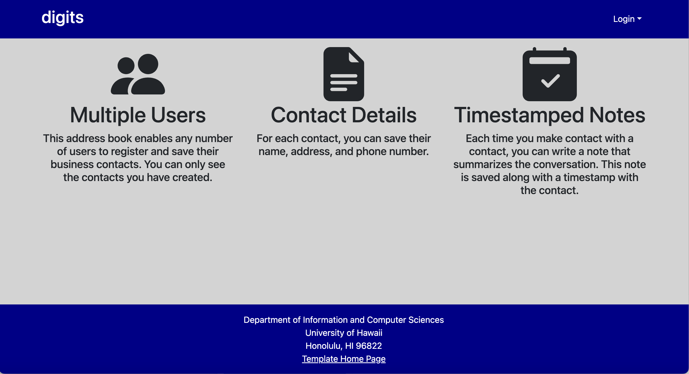
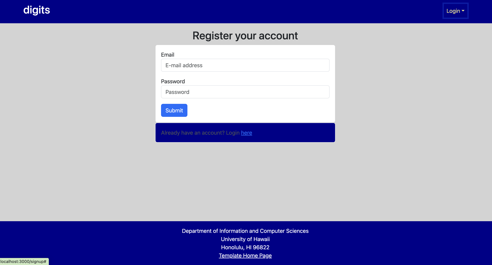
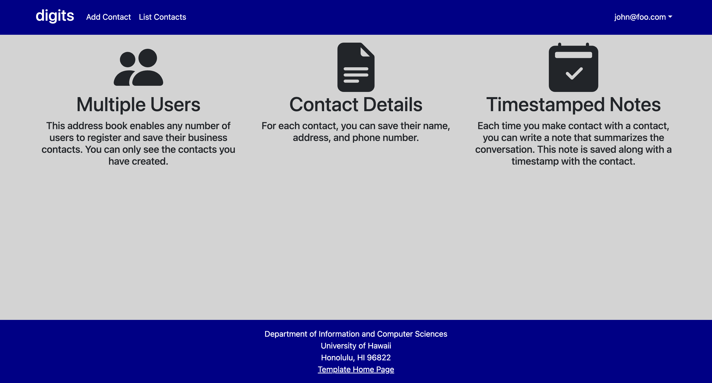
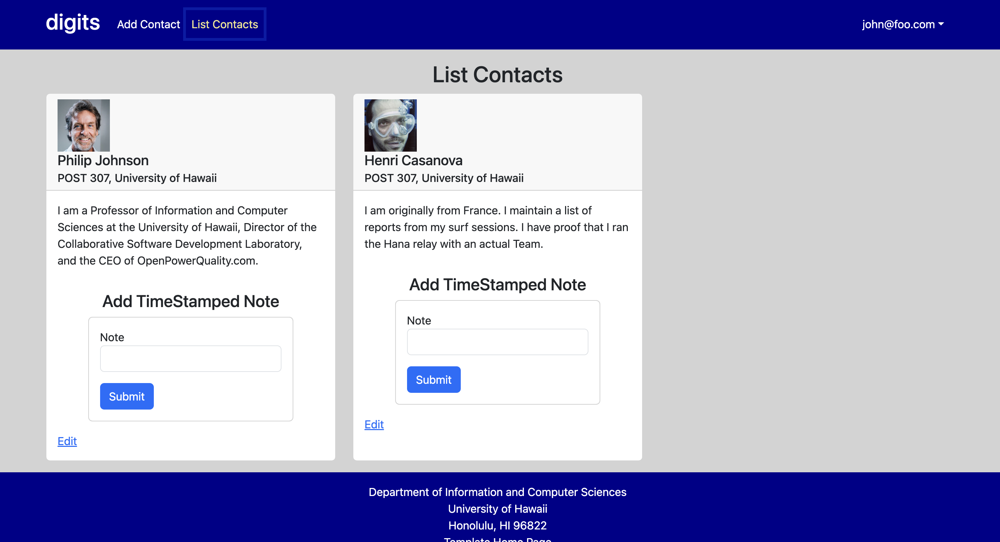
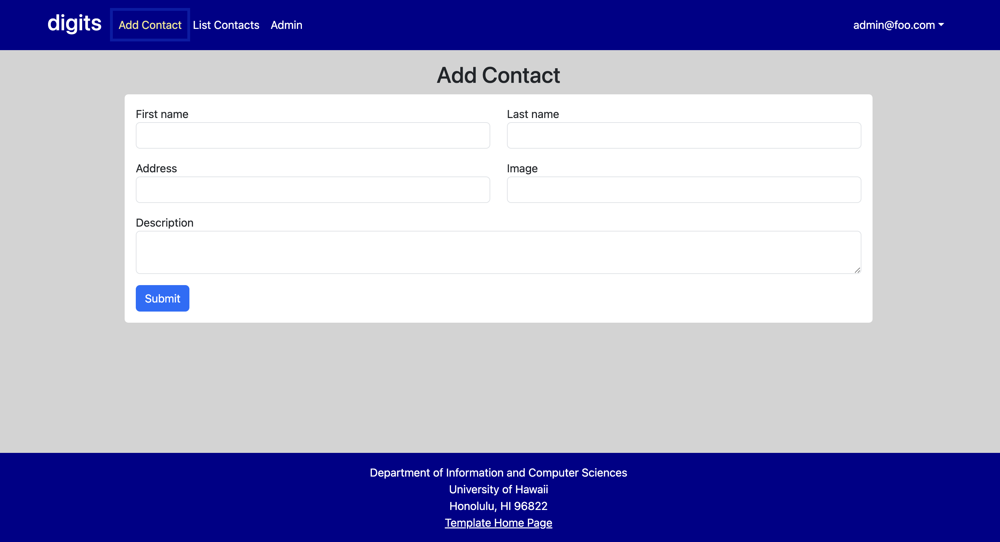
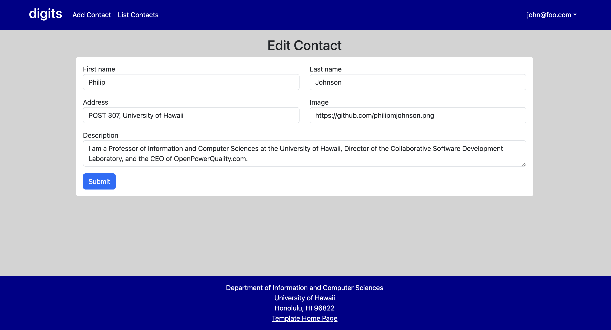
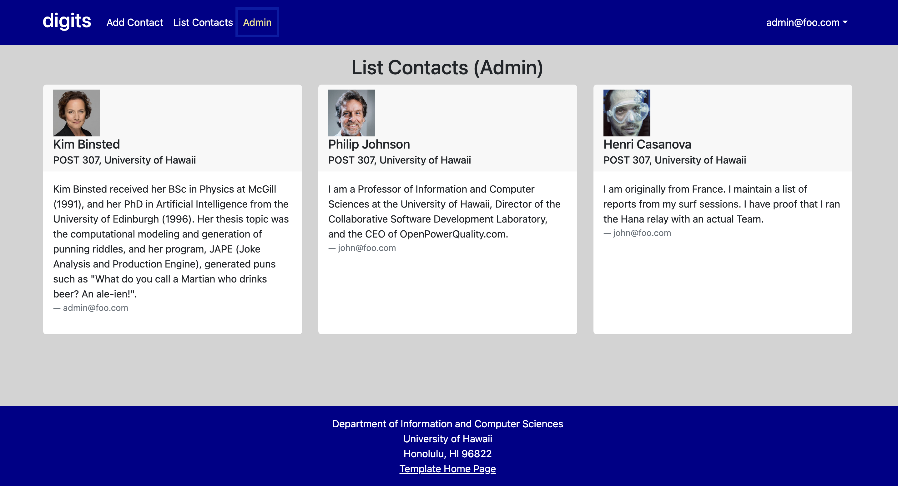

# Digits




Digits is an application that allows users to:


  * Register an account.
    interface.
  * Create and manage a set of contacts.
  * Add a set of timestamped notes regarding their interactions with each contact.


## Installation

First, [install Meteor](https://www.meteor.com/install).

Second, go to [Digits Template](https://github.com/elsawong1/digits.git), and click the "Use this template" button. Complete the dialog box to create a new repository that you own that is initialized with this template's files.

Please note that Digits is a private repo and so you will need to request permission from the author to gain access to the repo.

Third, go to your newly created repository, and click the "Clone or download" button to download your new GitHub repo to your local file system.  Using [GitHub Desktop](https://desktop.github.com/) is a great choice if you use MacOS or Windows.

Fourth, cd into the app/ directory of your local copy of the repo, and install third party libraries with:

```
$ meteor npm install
```
Once the libraries are installed, you can run the application by invoking:

```
$ meteor npm run start
```
The first time you run the app, it will create some default users and data. Here is the output:

```
> meteor-application-template-react@ start /Users/elsawong/Documents/GitHub/ICS314/digits/app
> meteor --no-release-check --exclude-archs web.browser.legacy,web.cordova --settings ../config/settings.development.json

[[[[[ ~/Documents/GitHub/ICS314/digits/app ]]]]]

=> Started proxy.                             
=> Started HMR server.                        
=> Started MongoDB.                           
I20240330-09:50:52.790(-10)? Creating the default user(s)
I20240330-09:50:52.813(-10)?   Creating user admin@foo.com.
I20240330-09:50:53.265(-10)?   Creating user john@foo.com.
I20240330-09:50:53.395(-10)? Creating default contacts.
I20240330-09:50:53.395(-10)?   Adding: Johnson (john@foo.com)
I20240330-09:50:53.434(-10)?   Adding: Casanova (john@foo.com)
I20240330-09:50:53.435(-10)?   Adding: Binsted (admin@foo.com)
=> Started your app.

=> App running at: http://localhost:3000/
```
If all goes well, the template application will appear at http://localhost:3000. You can login using the credentials in [setting.development.json](config/settings.development.json), or else register a new account. 

Lastly, you can run ESLint over the code in the imports/ directory with:

```
$ meteor npm run lint
```

## Walkthrough

The following sections describe the major features of this template.

###  Landing Page

When you first bring up the application, you will see the landing page that provides a brief introduction to the capabilities of Digits:


###  Register

If you do not yet have an account on the system, you can register by clicking on “Login”, then “Sign Up”:



### Sign in

Click on the Login link, then click on the Signin link to bring up the Sign In page which allows you to login:

### Home Page
After successfully logging in, the system takes you to your home page. It is just like the landing page, but the NavBar contains links to list contact and add new contacts:



### List Contacts

Clicking on the List Contacts link brings up a page that lists all of the contacts associated with the logged in user. This page also allows the user to add timestamped “notes” detailing interactions they’ve had with the Contact:



### Add Contacts
licking on the Add Contact link brings up a page that allows users to input new contacts:



### Edit Contacts

From the List Contacts page, the user can click the “Edit” link associated with any Contact to bring up a page that allows that Contact information to be edited:



### Admin Mode

It is possible to designate one or more users as “Admins” through the settings file. When a user has the Admin role, they get access to a special NavBar link that retrieves a page listing all Contacts associated with all users:



